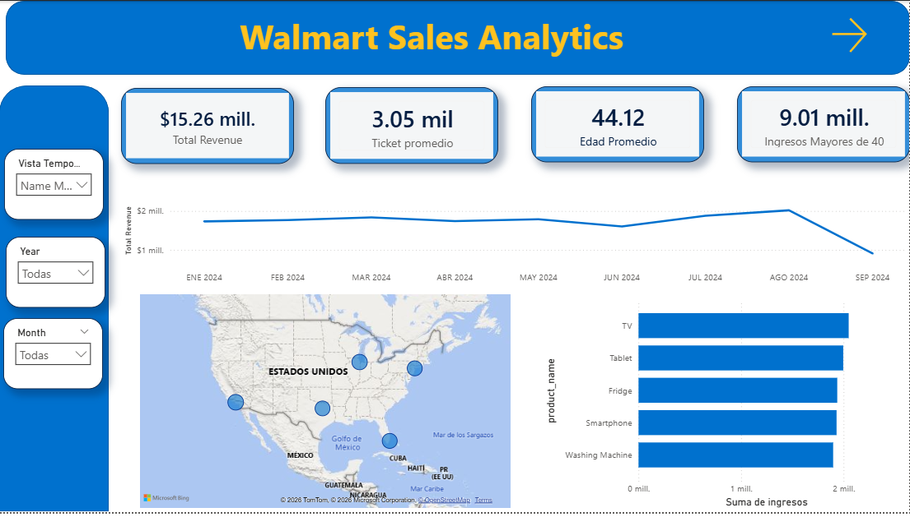
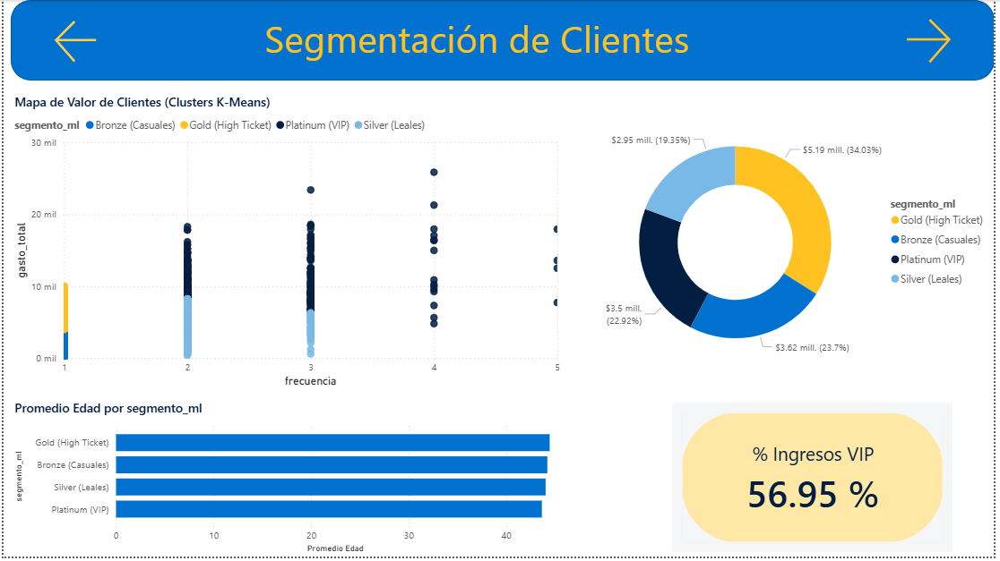
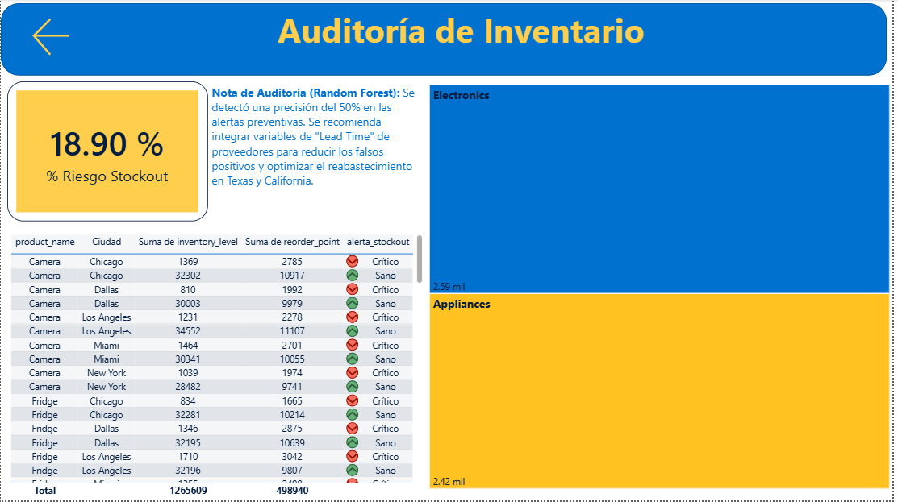

# 🛒 Walmart Data-Driven Logistics & Customer Intelligence


> Este proyecto despliega una solución integral de **Data Science** para Walmart EE. UU., combinando inteligencia de clientes (K-Means) con auditoría logística preventiva (Random Forest). 
> ## 🎯 Impacto en el Negocio
**Retención VIP:** Identificación de los segmentos Platinum y Gold, responsables del **56.95% de los ingresos totales**. * **Auditoría Logística:** Revelación estadística de que el indicador actual de *stockouts* es ruido aleatorio (49% de precisión base), impulsando una recomendación de auditoría en la captura de datos de almacén. * **Estrategia Demográfica:** El core del negocio se concentra en clientes de **44 años en promedio**, permitiendo campañas de marketing hiper-segmentadas.


---

## 🎯 Objetivo

- **¿Qué pregunta de negocio buscas responder?** Identificar a los clientes más valiosos para estrategias de retención y predecir el riesgo de desabastecimiento (*stockouts*) en almacén basándose en tiempos de entrega y niveles de inventario. 

- **¿Qué decisión podría tomarse con este análisis?** Lanzar campañas de marketing dirigidas a los segmentos "Platinum" y "Gold", y auditar el sistema actual de captura de inventarios, ya que se comprobó estadísticamente que el indicador actual es ruido aleatorio.

---

## 📁 Estructura del Proyecto

```
📂 walmart-retail-ml/
├── 📂 data/
│   ├── raw/          # Datos fuente (5000 registros, 32 variables)
│   └── processed/    # Dataset final tras Feature Engineering
├── 📂 notebooks/
│   ├── 01_EDA.ipynb                            # Análisis Exploratorio y Limpieza
│   ├── 02_Customer_Segmentation_KMeans.ipynb   # Clusterización de Clientes
│   └── 03_Stockout_Prediction                  # Modelo de Clasificación Logística
│   └── 04_Data_Prep_PowerBI.ipynb              # Preparación para Visualización
├── 📂 outputs/
│   └── visualizaciones/                        # Gráficas exportadas
├── 📂 dashboard/
|    └── Walmart_Analytics_Dashboard.pbix # Reporte Interactivo Pro
|    📂 src/
|     └── etl/
|            ├── 00_load_data_to_postgres.py
|     └── sql/ 
|            ├── schema.sql   
├── requirements.txt
├── walmart_pro.json
└── README.md
```

---

## 🔍 Dataset

| Campo         | Detalle          |
| ------------- | ---------------- |
| **Fuente**    | Kaggle / Walmart |
| **Registros** | 5000 filas       |
| **Variables** | 32 columnas      |
| **Periodo**   | 2024             |
| **Formato**   | CSV / SQL        |


---

## 🛠️ Stack Tecnológico

- **Backend:** Python (Pandas, NumPy, Scikit-Learn).
- **Frontend / BI:** Power BI (DAX, Field Parameters).
- **ML Tech:** K-Means Clustering y Random Forest Classifier.

---

## 📈 Hallazgos Principales

>1. **Concentración de Ingresos:** Los segmentos VIP (Platinum) y High Ticket (Gold) dominan la facturación.
>  2. **Falla en Indicadores:** El modelo Random Forest original falló con variables por defecto, lo que llevó a un proceso de **Feature Engineering** avanzado para identificar que el sistema de registro de inventario actual requiere una auditoría operativa inmediata.
>  3. **Geolocalización:** Texas y California se identificaron como los hubs críticos de ingresos y riesgo de desabasto.

1. **Insight 1:** Optimicé la estrategia de inventario y segmentación de una muestra de Walmart usando Machine Learning (K-Means y Random Forest) y Power BI
2. **Insight 2:** Identifiqué que el **56.95%** de los ingresos provienen de clientes VIP con un promedio de edad de **44 años**
3. **Insight 3:** Creé un sistema de alertas críticas para prevenir stockouts en las tiendas con mayor volumen de ventas

---

## 📊 Visualizaciones

| **Resumen Ejecutivo** | **Segmentación de Clientes** |
| :---: | :---: |
|  |  |
| **Auditoría de Inventario** | |
|  | |

---

## ▶️ Cómo Ejecutar el Proyecto

```bash
# 1. Clona el repositorio
git clone https://github.com/Alejandroarellanocamacho/Walmart-Data-Driven-Logistics-ML
cd Walmart-Data-Driven-Logistics-ML

# 2. Crea un entorno virtual (opcional pero recomendado)
python -m venv venv
source venv/bin/activate  # En Windows: venv\Scripts\activate

# 3. Instala dependencias
pip install -r requirements.txt

# 4. Abre el notebook principal
jupyter notebook notebooks/01_EDA.ipynb
```

---

## 🧠 Aprendizajes y Próximos Pasos

**Lo que aprendí:**
- Creé un sistema de alertas críticas para prevenir stockouts en las tiendas con mayor volumen de ventas
- Me enfrente a un Gran desafío cuando el primer entrenamiento en Random Forest  no quedo con las variables por defecto de la data, con conocimientos de algebra y estadistica logré identificar que debía colocar y crear nuevas variables, para asi tener un feature engineering.

**Lo que sigue:**
- [ ] Incorporar más fuentes de datos
- [x] Construir un dashboard interactivo
- [ ] Automatizar la actualización del dataset

---

## 👤 Autor

**Alejandro Arellano Camacho**
[](https://www.linkedin.com/in/alejandro-arellano-camacho/)
[](https://github.com/Alejandroarellanocamacho)
